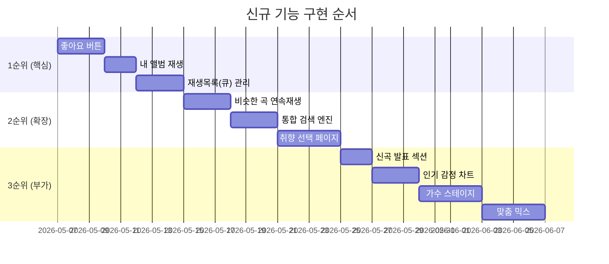

# 19. 신규 기능 기획서

> 새 채팅에서 작업 시 이 파일 + 관련 컴포넌트 파일 함께 첨부

---

## 1. 취향 선택 페이지

### 목적
최초 로그인 or 설정 메뉴에서 선호 아티스트/장르를 선택 → 추천 품질 향상

### 구현 계획
- **진입점**: 회원가입 직후 or 사이드바 "내 취향 설정" 버튼
- **화면 구성**
  ```
  ① 장르 선택 (K-pop, 발라드, 힙합, R&B, 인디, 팝, 재즈 등)
  ② 아티스트 선택 (YouTube 검색 or 하드코딩 인기 아티스트 목록)
  ③ 저장 → Firestore users/{uid}/preferences 에 저장
  ```
- **연동**: Recommendations.jsx 프롬프트에 취향 정보 추가
  ```js
  // 프롬프트에 추가
  `선호 장르: ${preferences.genres.join(', ')}`
  `선호 아티스트: ${preferences.artists.join(', ')}`
  ```
- **Firestore 구조**
  ```
  users/{uid}/preferences
    genres:   string[]
    artists:  string[]
    updatedAt: timestamp
  ```
- **새 파일**: `src/components/PreferencePage.jsx`
- **수정 파일**: `App.jsx` (screen 추가), `Sidebar.jsx` (메뉴 추가)

---

## 2. 인기 감정 기반 인기 차트

### 목적
MainScreen의 "인기 감정 TOP 5" 더미 데이터 → Firestore 실제 데이터 기반으로 교체

### 구현 계획
- **데이터 수집**: 감정 분석 결과 저장 시 전체 유저 집계용 카운터 업데이트
  ```
  Firestore: stats/emotionCounts
    기쁨: number
    슬픔: number
    ...
  ```
- **차트 연동**: 인기 감정 → 해당 감정으로 YouTube 차트 필터링
  ```
  감정: "슬픔" → q=kpop sad ballad official audio
  감정: "기쁨" → q=kpop upbeat happy official audio
  ```
- **수정 파일**: `MainScreen.jsx`, `App.jsx`

---

## 3. 나만의 앨범 & 맞춤 믹스

### 현재 상태
- 앨범 생성/삭제/곡 추가 기능 있음 (로컬 상태, 새로고침 시 초기화)

### 개선 계획
#### 나만의 앨범 (Firestore 영속화)
```
Firestore: users/{uid}/albums/{albumId}
  name:      string
  songs:     array
  cover:     string (첫 번째 곡 썸네일)
  createdAt: timestamp
```

#### 맞춤 믹스 (AI 추천)
- 앨범에 담긴 곡들 분석 → AI가 비슷한 곡 자동 추천
- **프롬프트 예시**
  ```
  내가 즐겨듣는 곡: [앨범 곡 목록]
  이 곡들과 비슷한 분위기의 한국 노래 8곡 추천해줘.
  ```
- **새 파일**: `src/components/MixPage.jsx`
- **수정 파일**: `Sidebar.jsx` (앨범 재생 버튼 추가), `App.jsx`

---

## 4. 원하는 가수 스테이지

### 목적
특정 아티스트의 노래만 모아서 스테이지 형태로 보여주기

### 구현 계획
- **진입점**: 사이드바 "아티스트 스테이지" or 추천 결과에서 아티스트 클릭
- **동작**
  ```
  아티스트 선택
    → YouTube API: q="아티스트명 official audio" 검색
    → 해당 아티스트 곡 목록 표시
    → 전체 재생 / 랜덤 재생
  ```
- **새 파일**: `src/components/ArtistStage.jsx`
- **수정 파일**: `App.jsx` (screen 추가), `Recommendations.jsx` (아티스트 클릭 이벤트)

---

## 5. 신곡 발표 섹션

### 목적
MainScreen에 최신 K-pop 신곡 섹션 추가

### 구현 계획
- **YouTube API 쿼리**
  ```
  q=kpop new release 2025 official audio
  order=date          ← 최신순 정렬
  publishedAfter=최근 30일
  ```
- **UI**: MainScreen 하단에 "이번 달 신곡" 가로 스크롤 카드
- **수정 파일**: `MainScreen.jsx`

---

## 6. 재생목록 (큐) 관리

### 목적
다음에 재생될 곡 목록을 보고 편집할 수 있는 큐 패널

### 구현 계획
- **UI**: MusicPlayer 우측에 큐 토글 버튼 → 오버레이 패널
  ```
  현재 재생 중
  ─────────────
  다음 재생 목록
  곡1 (드래그로 순서 변경)
  곡2
  곡3
  ```
- **기능**
  - 곡 순서 변경 (드래그 앤 드롭)
  - 큐에서 곡 제거
  - 큐 끝에 곡 추가
- **수정 파일**: `MusicPlayer.jsx`, `App.jsx` (currentSongs 편집 함수 추가)

---

## 7. 비슷한 곡 연속 재생

### 목적
현재 재생 곡이 끝나면 비슷한 분위기의 곡을 자동으로 이어서 재생

### 구현 계획
- **트리거**: MusicPlayer `onStateChange` → `ENDED` 이벤트
- **동작**
  ```
  현재 큐에 다음 곡 있으면 → 다음 곡 재생 (기존 동작)
  큐가 비었으면 → Gemini에 "비슷한 곡 1곡 추천" 요청 → 자동 재생
  ```
- **프롬프트**
  ```
  방금 재생한 곡: ${song.title} - ${song.artist}
  이 곡과 비슷한 분위기의 한국 노래 1곡만 추천해줘.
  JSON: { title, artist, youtubeQuery }
  ```
- **수정 파일**: `MusicPlayer.jsx`, `App.jsx`

---

## 8. 내 앨범 재생하기

### 현재 상태
- 앨범 내 곡 개별 재생만 가능
- 앨범 커버(표지) UI 존재

### 개선 계획
- **앨범 커버 제거**: Sidebar 앨범 헤더에서 🎵 이모지 아이콘 대신 심플한 텍스트만
- **앨범 전체 재생 버튼** 추가
  ```js
  // 앨범 헤더에 ▶ 버튼 추가
  onClick={() => onPlay(album.songs[0], album.songs)}
  // App.jsx handlePlaySong에 전체 목록 전달
  ```
- **수정 파일**: `Sidebar.jsx`

---

## 9. 통합 검색 엔진

### 목적
감정 분석 + 노래 직접 검색을 하나의 검색창으로 통합

### 구현 계획
- **UI**: MainScreen 입력창 옆에 검색 모드 탭
  ```
  [😊 감정 분석] [🔍 노래 검색]
  ```
- **감정 분석 모드**: 기존 동작 유지
- **노래 검색 모드**
  ```
  입력 → YouTube Data API 검색 (q=검색어, type=video, videoCategoryId=10)
       → 결과 목록 표시 → 바로 재생
  ```
- **수정 파일**: `MainScreen.jsx`

---

## 10. 좋아요 버튼 & 플레이리스트

### 목적
노래마다 ❤️ 버튼 → "좋아요 한 노래" 자동 플레이리스트 생성

### 구현 계획
- **UI**: 추천 결과, 히스토리, 차트 각 노래에 ❤️ 버튼 추가
- **Firestore 구조**
  ```
  users/{uid}/likes/{songId}
    title:      string
    artist:     string
    youtubeQuery: string
    likedAt:    timestamp
  ```
- **좋아요 플레이리스트 화면**
  - Sidebar에 "❤️ 좋아요" 섹션 추가
  - 클릭 → 좋아요 한 노래 전체 목록 + 전체 재생 버튼
- **수정 파일**: `Recommendations.jsx`, `History.jsx`, `MainScreen.jsx`, `Sidebar.jsx`, `App.jsx`
- **새 파일**: `src/components/LikesPage.jsx` (선택)

---

## 구현 우선순위 제안



---

## 새 채팅에서 기능 구현 시작 템플릿

```
00_README.md + 19_NEW_FEATURES.md 읽고 작업 시작해줘.

오늘 구현할 기능: [기능명]
관련 문서: [XX_FILENAME.md]
현재 파일: [파일명.jsx 첨부]
```
